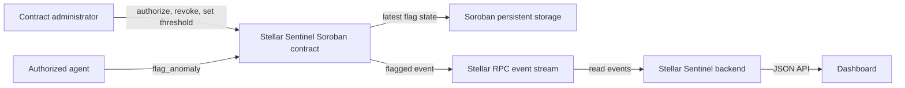

# Stellar Sentinel Soroban Contract

[](https://github.com/Stellar-Sentinel/sentinel-contracts/actions/workflows/ci.yml)
[](LICENSE)

Soroban contract for administrator-managed monitoring agents, a configurable 0–100 score threshold, and account flags. It publishes `flagged` events and stores the latest flag for each subject. It does not store full history; event indexing is needed for that.

## Architecture



The backend currently reads events and does not sign or submit transactions. The contract must be deployed and initialized on the same network as the backend's configured Soroban RPC before its events can appear in the dashboard.

## Project layout

- `src/lib.rs` — contract entry points, storage keys, authorization, threshold checks, event publication, and latest-flag lookup.
- `src/test.rs` — contract behavior tests using Soroban test utilities.
- `Cargo.toml` / `Cargo.lock` — Rust and Soroban SDK dependencies.
- `.github/workflows/ci.yml` — Wasm build, unit tests, and Clippy checks.

## Build and test

Requires stable Rust and the `wasm32-unknown-unknown` target. There are no contract-specific environment variables; network IDs and credentials are supplied to deployment tooling outside this repository.

```bash
rustup target add wasm32-unknown-unknown
cargo build --target wasm32-unknown-unknown --release
cargo test
cargo clippy --all-targets -- -D warnings
```

The deployable Wasm artifact is under `target/wasm32-unknown-unknown/release/`. CI runs the same build, test, and lint checks (Clippy).

## Contract interface

- `initialize(admin, default_threshold)` — one-time admin and threshold setup.
- `authorize_agent(admin, agent)` / `revoke_agent(admin, agent)` — manage flagging agents.
- `set_threshold(admin, threshold)` / `get_threshold()` — configure/read the threshold.
- `is_agent(agent)` — check agent authorization.
- `flag_anomaly(agent, subject, score)` — require an authorized agent and a score at or above threshold; persist the latest record and publish `flagged`.
- `get_latest_flag(subject)` — read the latest record, if one exists.

Only trusted addresses should receive agent authorization. The contract enforces the score range and threshold, but it cannot establish that an off-chain score is accurate. Storage follows Soroban TTL and archival rules. Deploy, initialize, and configure each network separately; never commit secrets.
